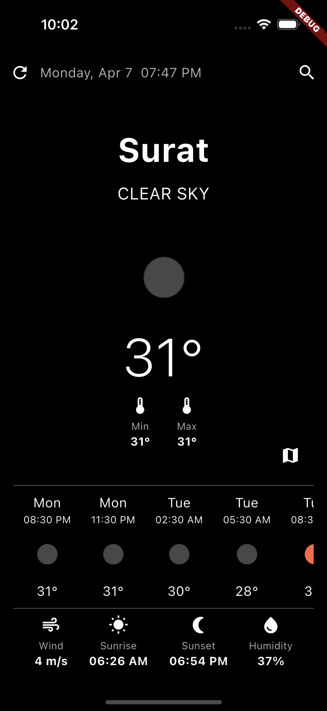
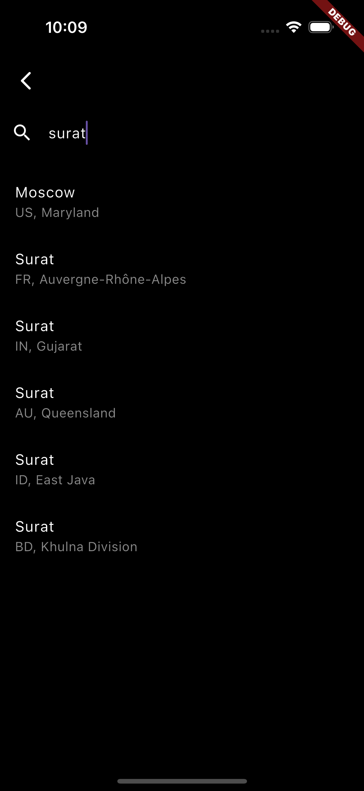
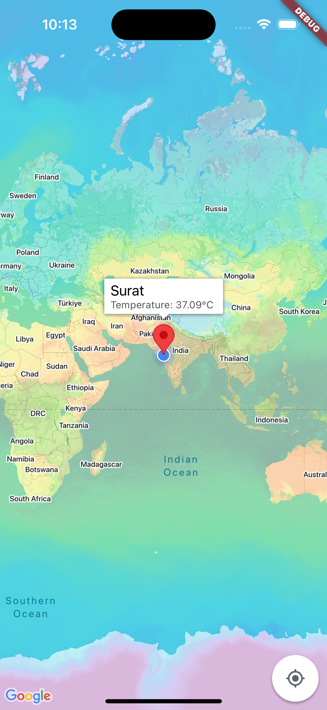

# 🌤️ Flutter Weather App

A clean and minimal Flutter app that shows live weather and 5-day forecast.
Includes Google Maps with weather overlays. Built using Bloc + Clean Architecture.

## 📚 Table of Contents

- [🌤️ Flutter Weather App](#️-flutter-weather-app)
  - [📚 Table of Contents](#-table-of-contents)
  - [✅ Features](#-features)
  - [🧱 Architecture](#-architecture)
  - [📁 Folder Structure](#-folder-structure)
  - [⚙️ Setup Instructions](#️-setup-instructions)
  - [🖼️ Screenshots](#️-screenshots)
  - [🧪 Testing](#-testing)
  - [⚖️ Trade-offs \& Decisions](#️-trade-offs--decisions)
  - [📬 Deliverables](#-deliverables)
  - [📮 Download the apk](#-download-the-apk)

## ✅ Features

- 📍 Live weather (via location or search)
- 📆 5-day forecast
- 🗺️ Google Maps with weather overlays
- 🧊 Tap marker = temp info
- 🔁 Location or city search
- ⚠️ Error handling (api failure, denied location)

## 🧱 Architecture

- ✅ Clean Architecture (data, domain, presentation)
- ✅ Bloc/Cubit for state management
- ✅ Dependency injection used

## 📁 Folder Structure

```
lib
├── main.dart
└── src
    ├── configs
    │   └── injector
    ├── core
    │   ├── api
    │   ├── errors
    │   ├── extensions
    │   ├── services
    │   ├── usecase
    │   └── utils
    └── features
        └── weather
            ├── data
            │   ├── datasources
            │   ├── models
            │   └── repositories
            ├── domain
            │   ├── entities
            │   ├── repositories
            │   └── usecases
            └── presentation
                ├── cubit
                │   ├── geo_city
                │   └── weather
                ├── pages
                └── widgets

27 directories

```


## ⚙️ Setup Instructions

1. **Clone**
```bash
git clone https://github.com/iabhishekmp/my_weather.git
cd my_weather
```

2. **Install packages**
```bash
flutter pub get
```

3. **Add Openweather API Key**

- Get OpenWeatherMap key: https://openweathermap.org/api

- Pass it while running/building the app via `--dart-define`
- OR add it in `launch.json` file in VSCODE
 ```json
  "args": [
    "--dart-define",
    "API_KEY=xxxxxxxxxxxxxxx"
  ]
```

4. **Add Google Map key**
- Get Google Maps key: https://console.cloud.google.com/
- This will be the env variable as well.
- ###### Android
  - in VSCODE `launch.json`
   ```json
   "env": {
      "MAPS_API_KEY": "XXXXXXXXXXXXXXXXXX"
   }
   ```

   - OR in terminal you can export the key while building the apk/aab
  ```bash
  export MAPS_API_KEY="XXXXXXXXXXXXXXXXXX"
  ```

- ###### iOS
- Env variable can be added in Xcode
- `Runner > Edit Scheme > Run > Environment Variables > + Plus icon`
  - ( Remember to unselect the `Shared` checkbox at bottom)

- FOR QUICK RUNNING
  - replace the key in `ios/Runner/AppDelegate.swift`
      ```swift
      GMSServices.provideAPIKey("XXXXXXXXXXXXXX")
      ```

5. **Run**
```bash
flutter run --dart-define "API_KEY=XXXXXXXXXXXX"
```


## 🖼️ Screenshots

<p>
  
  &nbsp;&nbsp;&nbsp;
  
  &nbsp;&nbsp;&nbsp;
  
</p>


## 🧪 Testing

Structure supports:
- ✅ Bloc tests
- ✅ Use case/repo tests
- ✅ Datasource tests

To run:
```bash
flutter test
```

## ⚖️ Trade-offs & Decisions

- Focused on clean structure & logic inspired by [flutter_bloc_clean_architecture](https://github.com/Yoga3911/flutter_bloc_clean_architecture)
- UI Inspired from [Clima app](https://github.com/Lacerte/clima)
- Didn't use `go_router`
- Theme management not added

## 📬 Deliverables

- ✅ Source code
- ✅ Weather map screen
- ✅ Manual + location search
- ✅ Error handling
- ✅ README file

## 📮 Download the apk


- App Link: [https://i.diawi.com/dyY8x3](https://i.diawi.com/dyY8x3)
- App size: ~8MB
- Command used:
   ```bash
   flutter build apk --dart-define "API_KEY=XXXXX" --target-platform=android-arm64
   ```